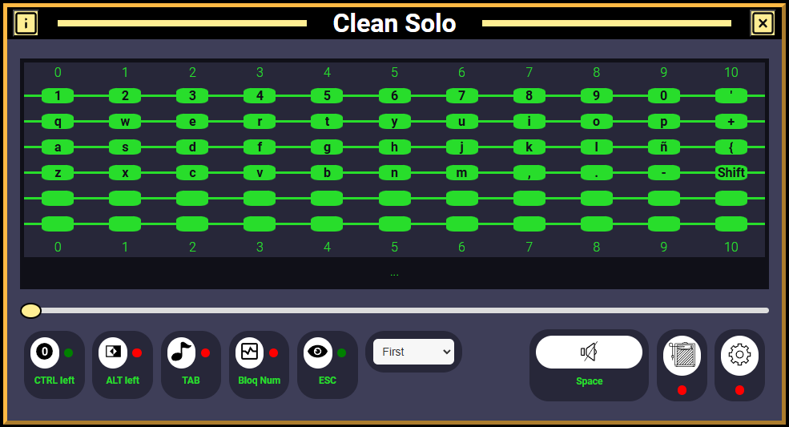
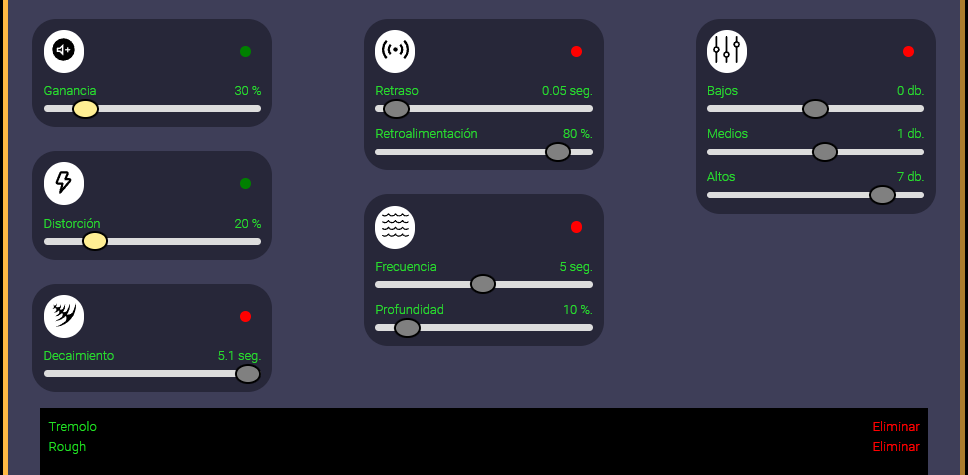

# Guitar-App

Versión 0.1 (23/11/2024)

Simulador de guitarra electrica hecho con HTML, CSS, JavaScript, ReactJs y ToneJs

         

Para ejecutar este proyecto, es necesario tener instalado Node.js y Visual Studio Code. Sigue estos pasos:

Puedes ir al siguiente link para ver el proyecto en producción, aunque aun me faltan varios ajustes...
https://bejewelled-smakager-045ecc.netlify.app

1. Descarga este proyecto y arrastra la carpeta "guitar-app" al editor de codigo fuente.
2. Abre una nueva terminal, clic en "Terminal", opción "New Terminal".
3. Introduce el comando "npm install" para instalar todas las dependencias asociadas al proyecto.
4. Introduce el comando "npm run dev" y ve a la URL "http://localhost:5173/"

Tarea pendiente: mejorar este proyecto, plazo limite: 30/04/2025
